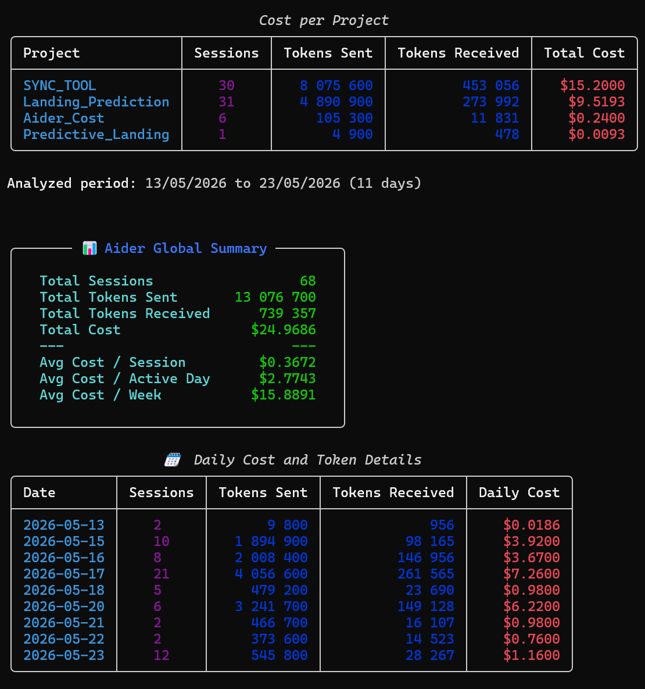

# Aider Stats

> A clean CLI tool to analyze your [Aider](https://aider.chat/) chat history — track costs and token usage across all your projects, right from the terminal.

[](https://github.com/odinrmt/aider-stats/actions/workflows/ci.yml)
[](https://www.python.org/downloads/)
[](LICENSE)
[](https://github.com/astral-sh/ruff)
[](https://mypy-lang.org/)

<!-- Once published to PyPI, add:
[](https://pypi.org/project/aider-stats/)
-->

---

## Features

- **Project-wise analysis** — costs and tokens aggregated per project.
- **Daily breakdown** — track spending and token consumption day by day.
- **Global summary** — totals plus averages per session, active day, and week.
- **Recursive scanning** — automatically discover every `.aider.chat.history.md` in a directory tree.
- **Readable output** — rich, colored tables and panels in your terminal.

## What is an Aider chat history file?

When you use [Aider](https://aider.chat/) (the AI pair-programming tool), it logs your
conversations, token usage, and costs into a markdown file named
`.aider.chat.history.md`, located at the root of each project. **Aider Stats** parses
those files to give you a clear view of your AI spending and usage patterns.

## Installation

> **Note:** PyPI installation works once the package is published. Until then, use the
> *From source* method below.

### With pipx (recommended — isolated global install)

```bash
pipx install aider-stats
```

### With pip

```bash
pip install aider-stats
```

### From source (with [uv](https://docs.astral.sh/uv/))

```bash
git clone https://github.com/odin/aider-stats.git
cd aider-stats
uv sync
uv run aider-stats --help
```

## Usage

### Analyze a single history file

By default, the tool looks for `.aider.chat.history.md` in the current directory:

```bash
aider-stats
```

Or point it at a specific file:

```bash
aider-stats --file /path/to/.aider.chat.history.md
```

### Scan a directory for multiple projects

```bash
aider-stats --scan /path/to/projects/
```

### Show the version

```bash
aider-stats --version
```

## Example output



## How it works

Aider reports a **cumulative session cost** on each line, while token counts are
**per message**. Aider Stats therefore sums tokens across messages but takes the
final session-cost value, then aggregates everything by project and by day.

## Development

Set up the environment and run the same checks as CI:

```bash
uv sync --all-extras --dev

uv run ruff check .          # lint
uv run ruff format --check . # formatting
uv run mypy src/             # strict type checking
uv run pytest                # tests
```

See [CONTRIBUTING.md](CONTRIBUTING.md) for the full contribution workflow.

## License

Distributed under the MIT License. See [LICENSE](LICENSE) for details.